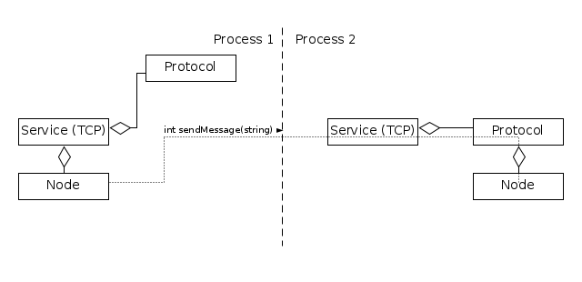
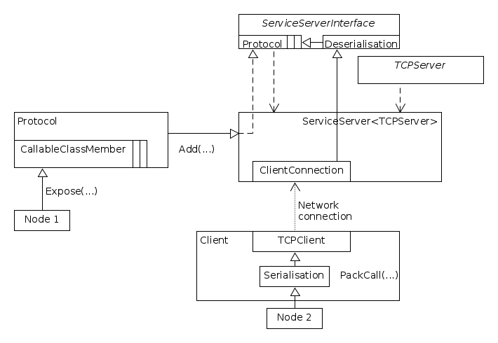
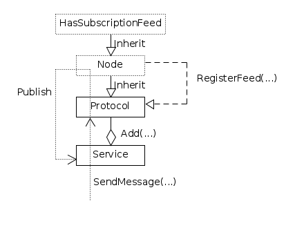

Network Framework
=================

.. toctree::
   :maxdepth: 2
   :caption: Contents:

Objective
---------
The objective of the Fetch network library is to make it easy to network, 
in particular to make it easy to create protocols using our rpc framework.
fetch-networking handles low level internet protocol (TCP) and RPCs and serialization.

Quick start
-----------
So you want to create a P2P network making RPC calls to each other. To this end, there is a basic
`quick start` example program. This will illustrate all of the components working together to
create basic network communications.
This will use the example program 
`examples/quick_start/quick_start.cpp`
. You should have compiled it into build/examples if you followed the README.

As can be seen above, we are going to use the rpc framework to create a simple bi-directional 
message sending program. We will do this on localhost, although this could be in any
two network locations.

The Fetch network architecture is to have a service to which you can attach multiple protocols.
The user can then call a service's protocol. This will correspond to a function call on the remote,
in this case we have a `node` that we connect function calls to.

The Service handles the low level TCP protocol and socket creation/destruction.

Note, in this case we are running two service/servers, so rpc communication can be bi-directional.
It is not actually required that both sides are running a tcp server.

To test the program:

.. code-block:: bash
                
                term1$ ./build/examples/quick_start 8000 8001
                term2$ ./build/examples/quick_start 8001 8000

High level architecture
--------------------------------------

In this section we delve a little deeper into the architecture.

Subscription
--------------------------------------

The Service framework also allows a 'subscription' model. This allows multiple clients to listen
to a Node's feed(s). For example a Node might have a publication feed for several lanes. Interested
parties can then be notified when the miner has received a block containing their lanes.

To test out the code, there is going to be one server with one or more listeners. Port numbers etc.
are hard coded for ease of use.

.. code-block:: bash
                
                term1$ ./build/examples/subscribe_server
                term2$ ./build/examples/subscribe_listener
                term3$ ./build/examples/subscribe_listener
                term4$ ./build/examples/subscribe_listener

It should now be possible for the server to send messages that are broadcast to all of the 
listeners. Note that although this is done on localhost this is of course possible across a network
connection.

This is very similar to the quick_start example in that you create a protocol and add it to 
a service. However, in this example instead of creating callables that point to our node class
it is our node class that will publish to the service. 

For ease of use, and to demonstrate a slightly different paradigm, inheritance is used to 
create only two objects, the service and the protocol. This allows the user to make calls 
directly to the protocol.

Anatomy of an RPC call
--------------------------------------

What if I want to send my custom class over the rpc interface?
----------------------------------------------------------------
Refer to the serialization section if you need to understand implementation details. Otherwise,
the quick start example creates a dummy class that illustrates how you can do this.

.. code-block:: cpp
   :linenos:

   // Custom class we want to pass using the RPC interface
   class DataClass
   {
   public:
     std::vector<int> data_;
   };

.. code-block:: cpp
   :linenos:

   // All classes and data types must have an associated Serialize and Deserialize
   // function So we define one for our class (vector already has a ser/deser)
   template <typename T>
   inline void Serialize(T &serializer, DataClass const &data)
   {
     serializer << data.data_;
   }

   template <typename T>
   inline void Deserialize(T &serializer, DataClass &data)
   {
     serializer >> data.data_;
   }

If you fail to correctly define a serialiser/deserialiser, you will get a message to the effect of:

.. code-block:: bash

                error: no matching function for call to ‘Deserialize(fetch::serializers::
                TypedByte_ArrayBuffer&, fetch::quick_start::DataClass&)’
